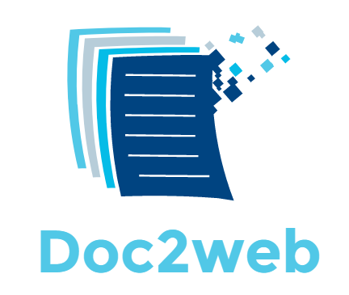

## Free your document 
##### Word to html converter engine
----

### Goals of the project
This project is an attempt to create an targeted, extensible, cross-platform and high performance wordprocessingML 
(open xml) to html converterer.

#### Doc2web is targeted
Let's say you have a 260 pages document and you want to extract just a single section and put it in a webpage,
you should be able to only render the targeted open xml paragraph to html without converting the whole document.
Doing so should be simple and efficient.

#### Doc2web is extensible
Let's say you want to convert a docx to html and add a links on all occurrences of the word "cat".
You should be able to do so without applying editiing any post-processed html. Doc2web provide a declarative
plugin system that allows any developer to yield virtual nodes or text transformations. 

These nodes will be then converted in tags, the text transformation will apply to the output without having to
think about imperative algorithms or preversvation of the other open features. 

IoC container will be use to allow plugins to works togheter as they the engine crawl the document.

#### Doc2web is cross platform
Doc2web leverage the new .NET STANDARD 2.0 which is supported on .NET CORE 2.0 and .NET 4.6.1, Mono 5.4,
Xamarin iOS 10.14 Xamarin Mac 3.8 and Xamarin Android 7.5.

#### Doc2web is fast
Rendering only what you need allows whusion to have lazy mechanism that fetch only what you need from the 
document.

------

### Roadmap 1.0 (2017 Q4)
- Core
  - Virtual nodes
    - Tag, style and attributes
  - Text tranformation
    - Insertions
    - Replacements
    - Deletions
  - Tag optimization and rendering
  - Crawl paragraphs, runs and track changes.
- Implemented plugins
  - Paragraphs
  - Runs
  - Numbering
  - Responsive margins
  - Track changes
- Benchmarks
    - Rendering single paragraph
    - Comparing against OpenXmlPowerTools
- Documentation
  - How to use the C# Api
  - How to extend with plugins