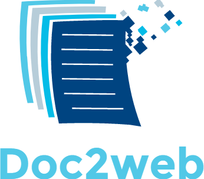

## Free your document
##### Word to html converter engine (work in progress)

### Goals of the project
This project is an attempt to create an lazy, extensible, cross- [ ]platform and high performance wordprocessingML 
(open xml) to html converter.

**We will not accept pull requests until we reach version 1.0.**

#### Doc2web is lazy
Doc2web will only gather the minimum text and css for the conversion. If you are converting a single paragraph you should expect a slim html, even if it's a 200 page's document that weights 5mb.

#### Doc2web is extensible
Doc2web provide a simple plugin system that allows any developer to add virtual nodes 
or text mutations. 

These nodes will be then converted in tags and the mutations will be applies to the output. All the hard work is done for you, you just have to describe the result that you want and Doc2web will give valid html.

The nodes and mutations positions uses real numbers so you can "squeeze" elements between 
text and other elements in a infinite fashion. The nodes also has Z index. The engine will use those to generate intersections and ensure that the html is valid what ever the nodes or mutations you throw at it.

An IoC container will be use to allow plugins to works together as they the engine crawls the document. It will also manage object lifecycle and provide clever garbage collection for better performance.

#### Doc2web is cross platform
Doc2web leverage the new .NET STANDARD 2.0 which is supported on .NET CORE 2.0 and .NET 4.6.1, Mono 5.4, Xamarin iOS 10.14 Xamarin Mac 3.8 and Xamarin Android 7.5.

#### Doc2web is fast
Doc2web is build for real time. Lazy mechanism and efficient cpu cycles and memory manage is at the core of this project goals.

Our current benchmarks (using an I7-5500U) converts 260 pages in ~180ms when the open xml
is simple and 40 pages in ~115 ms when the open xml is very complicated.

-------------------------------

### Roadmap 1.0 (2017 Q4)
- [x] Core
  - [x] Virtual nodes
    - [x] Tag, style and attributes
  - [x] Text tranformation
    - [x] Insertions
    - [x] Replacements
    - [x] Deletions
  - [x] Tag optimization and rendering
- [x] Implemented plugins
  - [x] Styling
    - [x] Media query
    - [x] Dynamic styling
    - [x] Paragraph styling
    - [x] Run styling
    - [ ] Interconnected styling
    - [ ] OpenXML Properties support
      - [x] Bold
      - [ ] Borders
      - [x] Caps
      - [x] Color
      - [x] Font size
      - [x] Highlighting
      - [x] Indentation (responsive)
      - [x] Italic
      - [x] Justification
      - [ ] Run fonts
      - [ ] Spacing
      - [x] Small caps
      - [x] Vanish
      - [x] Underline
  - [x] Numbering
    - [x] Roman, letters, ordinal, etc.
    - [x] Indentation
    - [x] Styling (theme and inline)
  - [x] Text processing
    - [x] Paragraphs
    - [x] Runs
    - [ ] Tabulation configuration
  - [x] Text fixes
    - [x] Break/tabs/hypen character insertions
    - [x] Cross references clean up
    - [x] Html escape
- [ ] Benchmarks
  - [x] Conversion
  - [x] Rendering
  - [x] Styling
  - [ ] Numbering
  - [ ] Comparing against OpenXmlPowerTools
- [x] CLI Tool
  - [x] Convert documents
  - [x] Verbose, debug and parallelism options
  - [x] Crash tests
  - [ ] Search for keywords in documents
- [ ] Documentation
  - [ ] XML documentation
  - [ ] How to use the C# Api
  - [ ] How to extend with plugins
  - [ ] Benchmark and performance breakdown
  - [ ] Doc2web vs other tools
  - [ ] Contribution guide
  - [ ] Plugin samples
  - [ ] Github pages
- [ ] Other
  - [ ] Coverage > 90%
  - [ ] Public and easy docker container with CLI/Benchmark
  - [ ] NuGet package publicly available
  - [ ] Continuous integration
